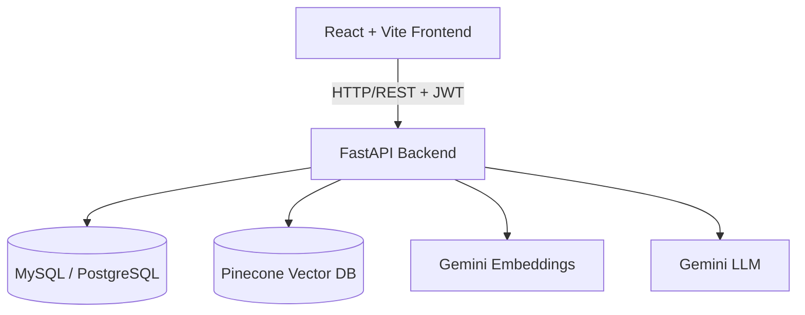
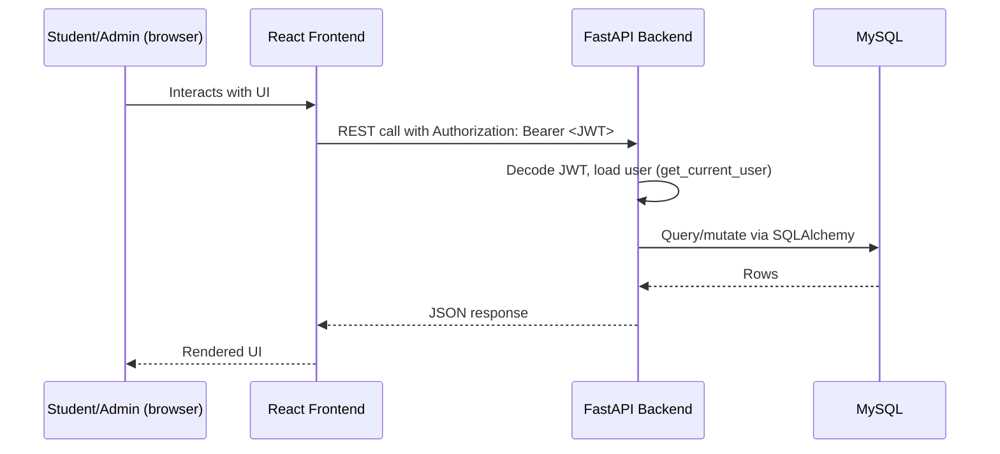
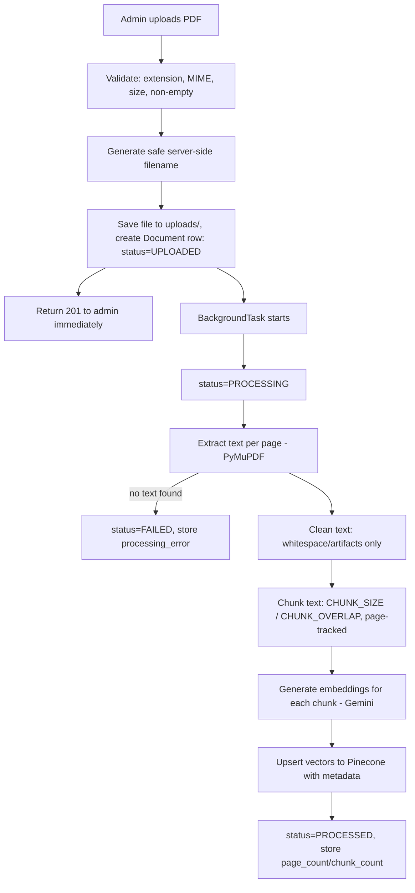
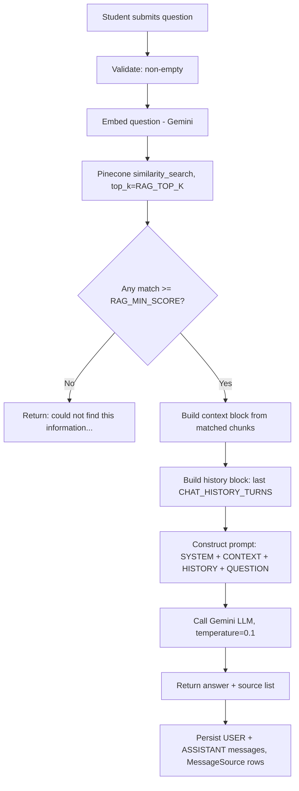
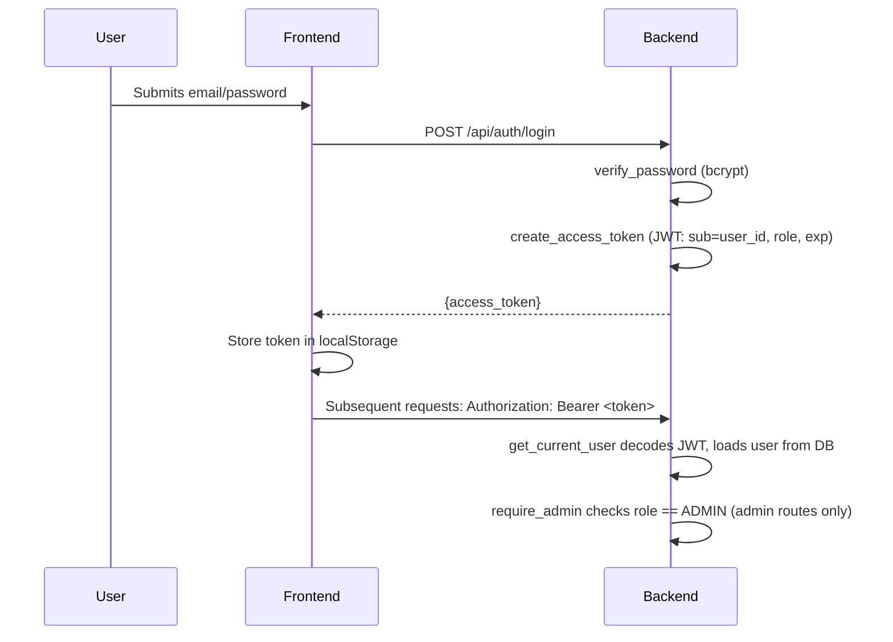

# Architecture — Campus Knowledge Assistant

## 1. System architecture

The frontend never talks to MySQL, Pinecone, or Gemini directly — every external call is proxied and authorized through the FastAPI backend. No API keys exist in frontend code or bundles.

## 2. Request flow (general)

## 3. Document ingestion flow

Reprocessing follows the same flow but first deletes existing vectors for that `document_id` from Pinecone, so no duplicate/stale vectors are left behind. Deletion follows the mirror path: delete vectors first (abort on failure, no orphan vectors), then delete the DB row and the file from disk.

## 4. RAG (question-answering) flow

Retrieved document text is always treated as **data**, never as instructions — the system prompt explicitly tells the LLM to ignore any embedded "instructions" found inside retrieved PDF content (see `app/rag/prompts.py`).

## 5. Authentication flow

## 6. Database responsibilities

- Stores users, their roles, and hashed passwords
- Stores document metadata (title, category, status, uploader, page/chunk counts) — never the PDF binary or embeddings
- Stores conversations and messages (full chat history)
- Stores `MessageSource` rows linking each assistant message to the documents/pages it cited

## 7. Pinecone responsibilities

- Stores one vector per document chunk, namespaced by `PINECONE_NAMESPACE`
- Vector IDs are deterministic (`doc-{document_id}-chunk-{chunk_index}`), which makes reprocessing/deletion straightforward
- Metadata on each vector carries enough context (document_id, title, category, page_number, chunk text) to answer a query without a second database round-trip

## 8. LLM responsibilities

- Gemini embeddings (`text-embedding-004`) turn text into vectors for both indexing and querying
- Gemini chat model (`gemini-1.5-flash` by default) generates the final answer, constrained by the RAG system prompt to only use retrieved context and to say "I don't know" when context is insufficient
